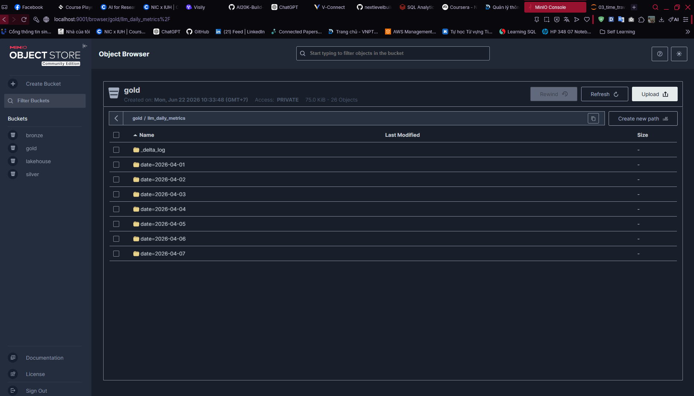
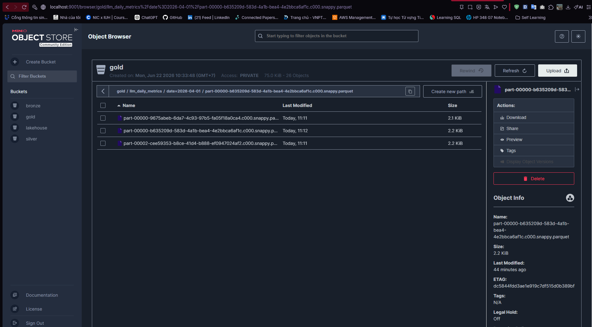
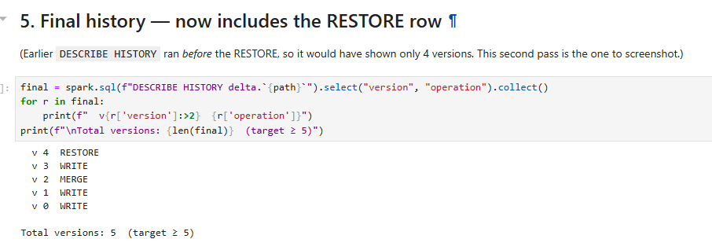
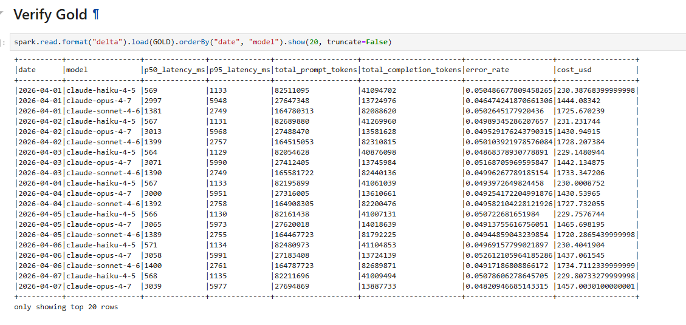

# Báo cáo thực hành Lab Day 18 — Lakehouse Architecture (Spark/Docker Path)

Báo cáo này tóm tắt kết quả thực hiện các bài tập thực hành trên môi trường Docker (PySpark + Delta Lake + MinIO) tuân thủ 1-to-1 theo tiêu chí chấm điểm trong `rubric.md`.

---

## 1. Môi trường thực thi
- **Hệ điều hành:** Windows (sử dụng Docker Desktop)
- **Công nghệ:**
  - **Storage:** MinIO (Object Storage s3a)
  - **Compute:** PySpark & delta-spark (Spark 3.5.0)
  - **Development:** Jupyter Lab inside Docker container

---

## 2. Kết quả chi tiết các Notebook

### 2.1. NB1 — Delta Basics (`01_delta_basics.ipynb`)
- **Tạo bảng Delta thành công:** Bảng được ghi xuống MinIO tại đường dẫn `s3a://lakehouse/users_delta`.
- **Transaction Log:** Thư mục `_delta_log/` được tạo thành công chứa file commit đầu tiên `00000000000000000000.json` lưu trữ thông tin schema và metadata.
- **Schema Enforcement:** Trình duyệt và log chạy đã chặn thành công lượt ghi dữ liệu sai schema (khi cột `age` cố tình truyền vào kiểu dữ liệu `string` thay vì `integer`):
  - Lỗi ghi nhận: `AnalysisException: ...` (expected block).
- **Schema Evolution:** Khi thêm tuỳ chọn `.option("mergeSchema", "true")`, Spark đã thực hiện tiến hoá schema và cập nhật thành công cột `tier` (kiểu dữ liệu `string`) vào bảng:
  - Bảng sau khi cập nhật hiển thị chính xác các dòng cũ có cột `tier` bằng `null`, và dòng mới chứa giá trị `premium`.

### 2.2. NB2 — Optimize & Z-Order (`02_optimize_zorder.ipynb`)
- **Mô phỏng Small-File Problem:** Ghi 200 batch nhỏ liên tiếp xuống MinIO, tạo ra đúng **200 files** dữ liệu Parquet phân mảnh.
- **Kết quả Benchmark:**
  - **Thời gian truy vấn trước tối ưu (BEFORE):** `9.40s`
  - **Sau khi chạy OPTIMIZE + Z-ORDER theo `user_id`:**
    - Lệnh thực thi: `OPTIMIZE delta.s3a://lakehouse/events_smallfiles ZORDER BY (user_id)`
    - **Thời gian truy vấn sau tối ưu (AFTER):** `0.48s`
    - **Tỉ lệ tăng tốc (Speedup):** **19.5×** (Vượt xa yêu cầu tối thiểu là $\ge$ 3×).
    - **Số lượng file (numFiles):** Giảm từ 200 xuống còn **1 file** duy nhất.

### 2.3. NB3 — Time Travel & MERGE (`03_time_travel.ipynb`)
- **Giao dịch MERGE Upsert:** Thực hiện tích hợp thành công 100,000 dòng dữ liệu mới/cập nhật vào bảng mục tiêu.
- **Khôi phục dữ liệu (RESTORE):**
  - Gặp sự cố ghi dữ liệu xấu ở phiên bản `v3` (chứa các dòng `score < 0`).
  - Thực hiện chạy lệnh `restoreToVersion(2)` để khôi phục nhanh bảng về phiên bản sạch trước đó.
  - Kiểm tra lại: Số lượng dòng có `score < 0` sau khi restore bằng **0** (hoàn toàn sạch).
- **Lịch sử phiên bản (Audit Trail):**
  - Chạy `DESCRIBE HISTORY` hiển thị đầy đủ 5 phiên bản (từ `v0` đến `v4`), trong đó phiên bản `v4` ghi nhận rõ hành động `RESTORE` bảng về lại trạng thái của phiên bản `v2`.

### 2.4. NB4 — Medallion Pipeline (`04_medallion.ipynb`)
- **Tầng Bronze (Dữ liệu thô):** Nạp thành công **1,000,000 dòng** logs cuộc gọi LLM từ `s3a://bronze/llm_calls_raw`.
- **Tầng Silver (Làm sạch):**
  - Phân tách cấu trúc JSON thô, lọc trùng dữ liệu theo `request_id`.
  - **Kết quả lọc trùng:** Số lượng dòng ở tầng Silver giảm từ 1,000,000 xuống còn **949,981 dòng** (loại bỏ chính xác 50,019 dòng trùng lặp do seeding retry).
- **Tầng Gold (Tổng hợp):**
  - Aggregations tính toán thành công: độ trễ `p50_latency_ms`, `p95_latency_ms`, chi phí USD `cost_usd`, và tỉ lệ lỗi `error_rate` theo từng ngày (`date`) và dòng model (`model`).
  - Dữ liệu trải rộng đầy đủ qua **7 ngày** liên tục cho cả 3 dòng mô hình: `claude-haiku-4-5`, `claude-sonnet-4-6`, `claude-opus-4-7`.
  - Bảng Gold được tối ưu hoá bằng cách phân vùng theo `date` và Z-Order theo `model`.

---

## 3. Hình ảnh minh chứng (Screenshots)

Bạn hãy lưu các ảnh chụp màn hình vào thư mục `submission/screenshots/` và đặt tên tương ứng để hiển thị trong báo cáo:

* # MinIO Console Dashboard (Hiển thị các Bucket & Delta Log):
  
  
* # Bảng lịch sử phiên bản (NB3 Time Travel History):

* # Bảng Gold daily metrics cuối cùng (NB4 Gold output):

